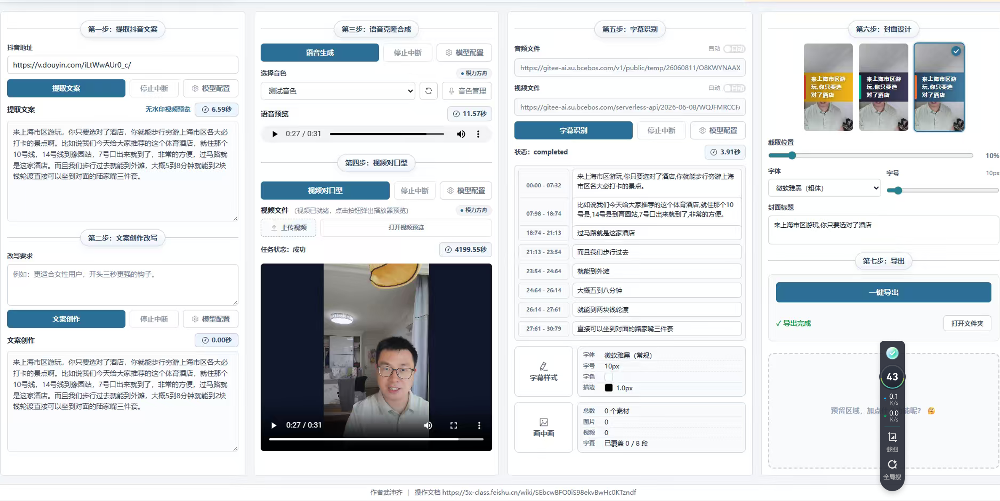

# Digital Human Video Pipeline

这是一个短视频口播二创与数字人生成项目。系统从抖音视频链接开始，自动下载视频、提取音频、识别口播文案，再根据用户要求改写文案、合成新语音、生成数字人口型同步视频、识别最终视频字幕、生成封面并导出成品。



## 技术栈

- 前端：Vue 3、Vite、TypeScript
- 后端：FastAPI、Python、ffmpeg、DashScope SDK
- 模型平台：阿里云百炼 / DashScope
- 本地存储：`backend/storage`
- 导出目录：`backend/exports`

## 整体流程

```text
抖音视频链接
  -> 下载视频到本地
  -> ffmpeg 提取音频
  -> qwen3.5-omni-plus 识别原始口播文案
  -> qwen3.5-flash 根据用户要求改写文案
  -> qwen3-tts-flash 合成新语音
  -> wan2.2-s2v 根据人物图片和语音生成口型同步视频
  -> qwen3.5-omni-plus 识别最终视频、生成字幕、检查一致性
  -> qwen-image-2.0-pro 生成封面
  -> 导出最终成品
```


## 模型配置

模型配置集中在：

```text
backend/app/core/model_config.yaml
```

当前配置：

| 步骤 | 功能 | 模型 |
| --- | --- | --- |
| 第一步 | 抖音视频文案提取 | `qwen3.5-omni-plus` |
| 第二步 | 短视频文案改写 | `qwen3.5-flash` |
| 第三步 | 文本转语音 | `qwen3-tts-flash` |
| 第四步 | 图片 + 语音生成口型同步视频 | `wan2.2-s2v` |
| 第五步 | 最终视频字幕识别与一致性检查 | `qwen3.5-omni-plus` |
| 第六步 | 封面文案生成 | `qwen3.5-flash` |
| 第六步 | 封面图片生成 | `qwen-image-2.0-pro` |
| 第七步 | 本地导出 | `local export / ffmpeg` |


## 快速启动

后端：

```bash
cd backend
python3 -m venv .venv
. .venv/bin/activate
pip install -r requirements.txt
cp .env.example .env
uvicorn app.main:app --reload --host 127.0.0.1 --port 8000
```

前端：

```bash
cd frontend
npm install
npm run dev
```

默认访问：

```text
http://127.0.0.1:5173
```

## 环境变量

模型 API Key 只放在后端 `.env` 文件中，不要暴露到前端。

```env
DASHSCOPE_API_KEY=your_api_key_here
DASHSCOPE_API_HOST=https://{WorkspaceId}.cn-beijing.maas.aliyuncs.com
```

